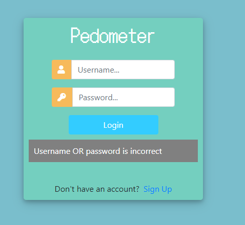
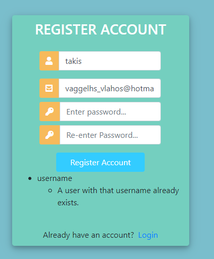
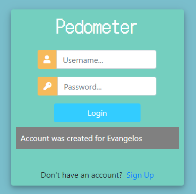
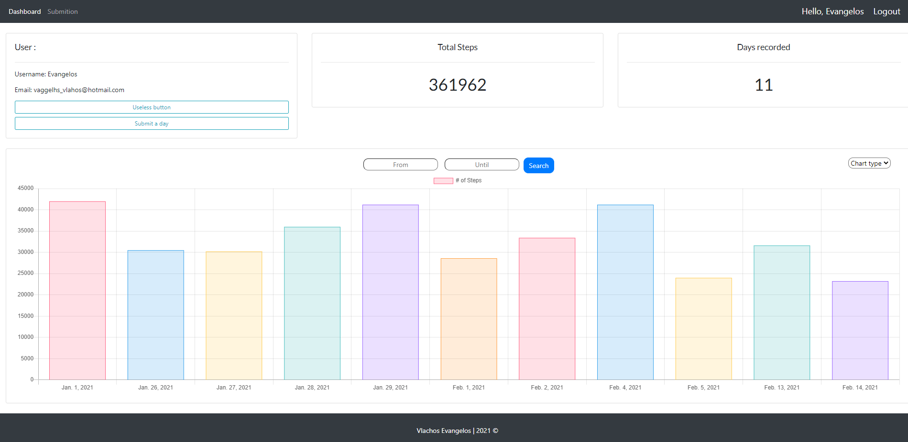
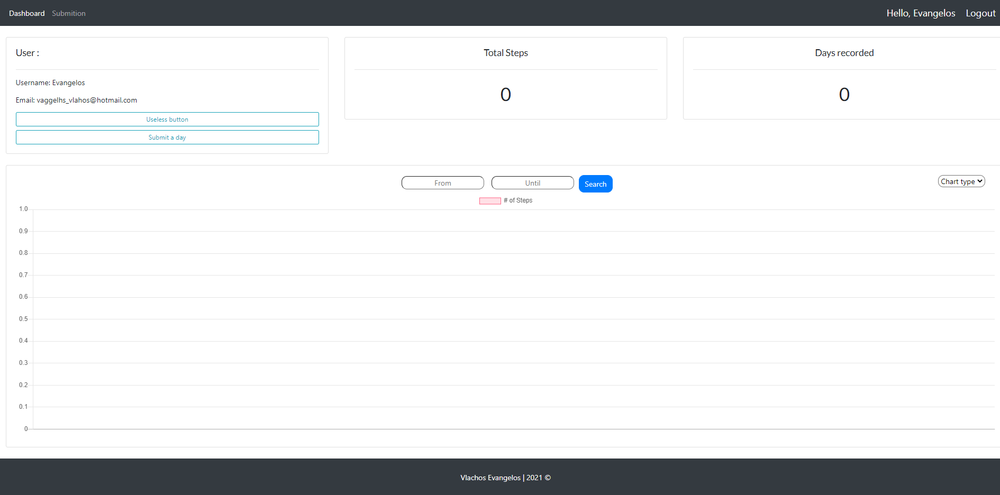
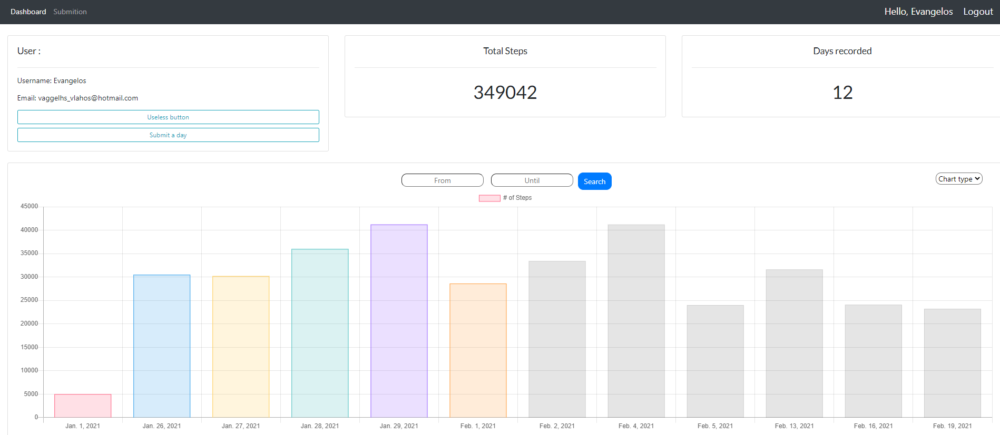
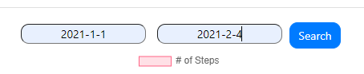

# step-tracker

A Django web app for logging daily steps and visualising your progress over
time. Built in 2021 while learning Django; refreshed in 2026 for the portfolio.

## Demo

**Login & registration**





**Dashboard**





**Logging a day's steps**


**Charts & date-range filtering**






## Features

- Register and log in with a custom user model (username, email, optional phone).
- Log a step count for a given day; the dashboard is gated behind login.
- One entry per user per day, enforced by a database unique constraint.
- Input validation: a day's steps must be between 1 and 50,000, and you can't
  log the same day twice.
- Dashboard summary showing your total steps and the number of days recorded.
- Visualise progress as a bar, line, or bubble chart (Chart.js), switchable on
  the fly without reloading.
- Filter the chart by a From/Until date range (django-filter). Each user only
  ever sees their own data.

## Tech stack

- Python 3.12
- Django 4.2.30
- python-decouple (reads settings/secrets from a `.env` file)
- django-filter (date-range filtering)
- SQLite (the default Django database)
- Chart.js for the visualisations
- HTML / SCSS / vanilla JS
- Bootstrap 4 (with a little jQuery), loaded via CDN

## Getting started

You'll need Python 3.12 installed. From a terminal:

```bash
# 1. Clone
git clone https://github.com/evangelosvlachos96-dotcom/step-tracker.git
cd step-tracker

# 2. Create a virtual environment
python -m venv .venv
```

**3. Activate it**

PowerShell:

```powershell
.\.venv\Scripts\Activate.ps1
```

bash:

```bash
source .venv/bin/activate
```

**4. Install dependencies**

```bash
pip install -r requirements.txt
```

**5. Create your `.env` from the example and add a `SECRET_KEY`**

PowerShell:

```powershell
Copy-Item .env.example .env
```

bash:

```bash
cp .env.example .env
```

Generate a fresh secret key:

```bash
python -c "from django.core.management.utils import get_random_secret_key; print(get_random_secret_key())"
```

Open `.env`, paste the value after `SECRET_KEY=`, and set `DEBUG=True` for local
development.

**6–10. Run it**

```bash
cd src
python manage.py migrate
python manage.py createsuperuser   # optional, for the /admin site
python manage.py runserver
```

Then open <http://localhost:8000>.

## Project structure

```
step-tracker/
├── src/                  # the Django project
│   ├── manage.py
│   ├── step_tracker/     # settings, urls, wsgi/asgi
│   ├── steps/            # the app: models, views, forms, filter, migrations
│   ├── templates/        # HTML templates
│   └── static/           # CSS/SCSS and JS
├── docs/                 # walkthrough of the original project (slides + PDF)
├── images/               # screenshots used in this README
├── requirements.txt
├── .env.example
└── README.md
```

## Documentation

The `docs/` folder holds a slide-by-slide walkthrough of the app's screens —
the design slides and write-up from the original 2021 project, lightly
refreshed:

- `docs/app-walkthrough.pptx` — the editable walkthrough deck.
- `docs/app-walkthrough.pdf` — a PDF export of the original deck (kept for
  convenience; the `.pptx` is the up-to-date source).

## About

Built in 2021 as a learning project while picking up Django. Refreshed in 2026 —
secrets moved to environment variables, the folder structure cleaned up, and
Django upgraded from 3.1 (long since end-of-life) to 4.2 LTS. The functionality
is the same as the original. I'm sharing it as a snapshot of what I was building
early in my career, not as a polished product.

## License

Released under the MIT License — see [LICENSE](LICENSE).

## Author

Vlachos Evangelos
<https://github.com/evangelosvlachos96-dotcom/step-tracker>
